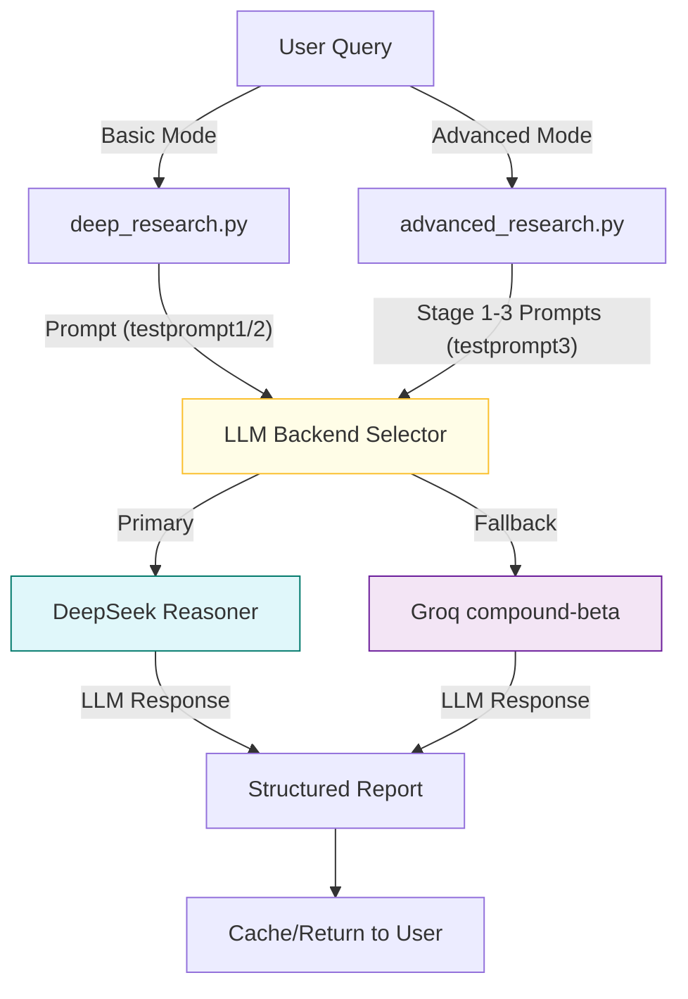

# 🧠 PMM Research Agent

A focused, lightning-fast research assistant built for Product Marketing Managers (PMMs) and GTM leaders.

Ask any strategic question — get a structured, multi-part answer synthesized by a DeepSeek-powered LLM in seconds.

Powered by DeepSeek's `deepseek-reasoner` model (with Groq fallback) and enhanced with cost-saving caching and clean markdown outputs.

---

## 🚀 Features

- **Zero UI Friction**: One question in → instant research report out
- **Two Research Modes**:
  - 🚀 **Advanced**: 3-stage research pipeline (planning → execution → publishing)
  - 📋 **Basic**: Groq-only fallback with structured prompts
- **Structured Answers**: Always outputs:
  1. 🔍 **Trends** - Key market trends and industry shifts
  2. 🏁 **Competitor Examples** - Concrete examples from real companies
  3. ⚔️ **Conflicting Insights** - Areas where approaches diverge
  4. ✅ **Recommendations** - Actionable strategic recommendations
  5. 📎 **Citations** - Credible sources supporting the analysis
- **Built-in Caching**: Avoid repeated API costs via SQLite
- **Web Search Integration**: Tavily for real-time source coverage
- **A/B Testing**: External prompt files for testing different approaches
- **Clipboard + Markdown Export**: Share reports in Notion, Slack, or email
- **Cost Control**: Session-based rate limiting and cache management

---

## 🛠 Tech Stack

| Layer | Technology | Purpose |
|-------|------------|---------|
| **Frontend** | Streamlit | Rapid UI development with Python |
| **Primary LLM** | DeepSeek `deepseek-reasoner` | Advanced reasoning and research |
| **Fallback LLM** | Groq `compound-beta` | Fast, reliable text generation |
| **Caching** | SQLite3 | Hash-based local cache to reduce API costs |
| **Search API** | Tavily | Web search for enhanced research |
| **Secrets** | `.env` / `.streamlit/secrets.toml` | Secure API key management |

---

## 📁 Project Structure

```
pmm-research-agent/
├── app.py                    # Streamlit app UI
├── deep_research.py          # Basic research (DeepSeek + Groq + SQLite)
├── advanced_research.py      # 3-stage research pipeline
├── prompt_manager.py         # A/B testing for prompts
├── testprompt1              # Comprehensive PMM research prompt
├── testprompt2              # Clean 5-section approach
├── testprompt3              # 3-stage research pipeline prompts
├── requirements.txt          # Python dependencies
├── .streamlit/
│   └── secrets.toml         # Streamlit secrets (local)
├── examples/
│   └── query_templates.md   # Research query examples
└── README.md                # This file
```

---

## 💻 Quick Start

### 1. Clone and Setup

```bash
git clone https://github.com/yourname/pmm-research-agent.git
cd pmm-research-agent
```

### 2. Install Dependencies

```bash
pip install -r requirements.txt
```

### 3. Configure API Keys

#### Option A: Environment Variables

```bash
cp env.example .env
# Edit .env and add your DeepSeek API key (and Groq as fallback)
```

#### Option B: Streamlit Secrets

Edit `.streamlit/secrets.toml`:

```toml
DEEPSEEK_API_KEY = "your-deepseek-api-key-here"  # primary backend
GROQ_API_KEY = "your-groq-api-key-here"          # fallback backend
TAVILY_API_KEY = "your-tavily-api-key-here"      # required for web search
research_mode = "aggressive"
```

### 4. Run the App

```bash
streamlit run app.py
```

Visit `http://localhost:8501` to start researching!

---

## 🧪 Example Queries

### Competitive Analysis
```
"Compare ClickUp and Asana's onboarding for technical users"
```

### Market Trends
```
"What are the key trends in B2B SaaS pricing strategies?"
```

### Go-to-Market Strategy
```
"How do Slack and Microsoft Teams approach enterprise sales?"
```

### Product Positioning
```
"Compare Notion and Airtable's positioning strategies"
```

### Real-Time Research
```
"What are the latest pricing changes in project management tools?"
```

---

## 📊 Sample Output

Each query produces a structured markdown report with real citations:

```markdown
## 🔍 Trends
- Growing emphasis on self-service onboarding
- Integration-first approach for technical users
- Gamification elements in user activation

## 🏁 Competitor Examples
- **ClickUp**: Interactive product tours with progress tracking
- **Asana**: Role-based onboarding with team templates

## ⚔️ Conflicting Insights
- ClickUp focuses on individual user activation
- Asana emphasizes team collaboration from day one

## ✅ Recommendations
1. Implement progressive disclosure in onboarding
2. Add role-based customization options
3. Include team collaboration features early

## 📎 Citations
- [G2 Reviews: ClickUp vs Asana](https://www.g2.com/compare/clickup-vs-asana)
- [Product Hunt discussions](https://www.producthunt.com/posts/clickup)
- [ClickUp Blog: Onboarding Best Practices](https://clickup.com/blog/onboarding)
- [Asana Documentation](https://asana.com/guide/help/getting-started)
```

---

## 🧠 Prompt Engineering

The agent uses a carefully crafted system prompt that ensures consistent, PMM-focused outputs:

```
You are a Principal PMM Strategist with deep expertise in product marketing, 
competitive analysis, and go-to-market strategy.

Your task is to provide a comprehensive, structured research report that PMMs 
and GTM leaders can immediately use for strategic decision-making.

ALWAYS structure your response in exactly this format:
1) Trends, 2) Competitor Examples, 3) Conflicts, 4) Recommendations, 5) Citations
```

Modify this in `deep_research.py` if needed.

---

## 💸 Cost Control Features

- ✅ **Local SQLite Cache**: Avoid duplicate API calls (24-hour TTL)
- ✅ **Session Rate Limiting**: Recommended 5 queries per session
- ✅ **Conservative Mode**: Faster, cheaper responses for simple queries
- ✅ **Cache Management**: Clear cache via UI or database reset
- ✅ **Export Options**: Download reports to avoid re-querying

---

## 🔧 Configuration Options

### Research Modes
- **Aggressive**: Comprehensive analysis with detailed examples
- **Conservative**: Faster responses with essential insights only

### Cache Settings
- **Duration**: 1-72 hours (default: 24 hours)
- **Enable/Disable**: Toggle caching via UI
- **Clear Cache**: One-click cache reset

### API Keys
- **DeepSeek**: Required for primary LLM functionality
- **Groq**: Required for fallback LLM functionality
- **Tavily**: Required for web search enhancement

---

## 🚀 Future Enhancements

### Planned Features
- [ ] **GitHub Gist Export**: Save reports as public/private gists
- [ ] **Slack Integration**: Direct sharing to Slack channels
- [ ] **Notion Export**: One-click Notion page creation
- [ ] **Multi-user Support**: Authentication and usage quotas
- [ ] **Report Templates**: Pre-built research frameworks

### Advanced Features
- [ ] **Batch Processing**: Multiple queries in parallel
- [ ] **Custom Prompts**: User-defined research frameworks
- [ ] **Data Export**: CSV/JSON export of structured data
- [ ] **API Endpoint**: REST API for programmatic access

---

## 🚦 Next Steps (Roadmap)

### ✅ 1. Advanced Research Pipeline (COMPLETED)
- **3-Stage Research Process**: Planner → Execution Agent → Publisher
- **Recursive Sub-Questioning**: Automatically breaks down complex queries
- **Multi-Source Synthesis**: Combines web research with LLM insights
- **Comprehensive Reports**: 800-1200 word structured reports

### 2. Enhanced Async Orchestration
- Optimize parallel processing for faster research
- Add progress tracking for long research tasks
- Implement retry logic for failed API calls

### 3. Advanced Citation & Web Search Handling
- Fetch, rank, and deduplicate web sources (Tavily, Bing, etc.)
- Extract and format citations with URLs, titles, and snippets
- Optionally, verify LLM claims against sources

### 4. User Controls & Customization
- Let users choose report length, depth, and research mode
- Expose advanced settings for power users
- Add research templates for common PMM queries

### 5. Multi-Agent Specialization
- Create specialized agents for different research domains
- Add domain-specific knowledge bases
- Implement agent collaboration patterns

---

## 🤝 Contributing

1. Fork the repository
2. Create a feature branch (`git checkout -b feature/amazing-feature`)
3. Commit your changes (`git commit -m 'Add amazing feature'`)
4. Push to the branch (`git push origin feature/amazing-feature`)
5. Open a Pull Request

---

## 📝 License

MIT License - see [LICENSE](LICENSE) file for details.

Use freely. Fork, remix, and deploy as your own internal research agent.

---

## 🔗 Acknowledgments

- **[Groq](https://groq.com)** — Blazing-fast LLM execution
- **[Streamlit](https://streamlit.io)** — Rapid Python web app development
- **[Tavily](https://tavily.com)** — Web search API
- **[SQLite](https://sqlite.org)** — Lightweight caching database

---

## 📞 Support

- **Issues**: [GitHub Issues](https://github.com/yourname/pmm-research-agent/issues)
- **Discussions**: [GitHub Discussions](https://github.com/yourname/pmm-research-agent/discussions)
- **Email**: your-email@example.com

---

*Built with ❤️ for Product Marketing Managers everywhere* 

*Contributions and suggestions welcome!* 

## 🗺️ Architecture Overview



- **DeepSeek Reasoner** is the primary backend for all research queries.
- **Groq compound-beta** is used as a fallback if DeepSeek is unavailable or rate-limited.
- Prompts are always loaded from external files for both basic and advanced modes.
- Caching ensures cost control and fast repeat queries. 